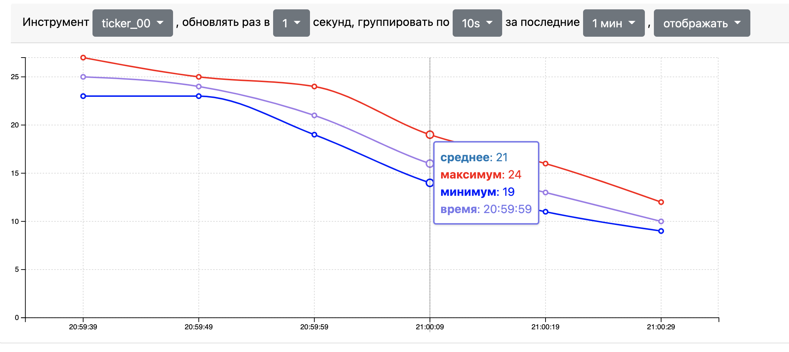

# Stock Example
Приложение имитации торговых акций и отображения их на графике



## О приложении
Приложение имитирует графики акций и отображает их в браузере.
Для отображения необхоимо выбрать отображаемый инструмент,
частоту обновлений (по дефолту 1 сек), вариант группировки - то,
какой промежуток времени будет агрегирован в одну точку и врменной 
дипазон - за какое время показывать данные.


## Локальный запуск
1) Запусть апи:
   - Требования: Python 3.8+
   - Скачать зависимости ```pip install -r reqiurements.txt```
   - Запустить апи ```python ./backend/main.py```
   - Проверить: `http://127.0.0.1:5000`
2) Запуск фронта:
   - Требования: Node.js 16+
   - Поставить зависимости ```npm i```
   - Запустить фронт ```npm run dev```
   - Проверить: `http://127.0.0.1:8080`


## Развернуть на сервере
- Требования: docker, docker-compose
- Собрать образы: ```docker-compose build```
- Запустить: ```docker-compose up -d```
